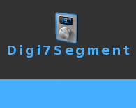

# Digi7Segment
- Controle 7 Segment Display Via Ardouino - (Serial Communication)                     
 

## Built With

* [ComPort Library](https://sourceforge.net/projects/comport/files/comport/) - ComPort Library ( by Dejan Crnila )

# Features  

- Set Digital Counter Via Serial Communication
- Send text on Serial Port

# Sketch
* [Sketch](https://github.com/walwalwalides/Delphi-Collection-Arduino/tree/master/Digi7Segment/Ardouino%20Sketch)- Digi7Segment Component + Sketch

# Licence
Copyright (C) 2019-2020, walwalwalides (walwalwalides@gmail.com)          
                                                                         
This software is provided 'as-is', without any express or implied          
warranty. In no event will the authors be held liable for any damages      
arising from the use of this software.                                     
                                                                         
Permission is granted to anyone to use this software for any purpose,     
including commercial applications, and to alter it and redistribute it    
freely, subject to the following restrictions:                            

1. The origin of this software must not be misrepresented; you must not    
   claim that you wrote the original software. If you use this software    
   in a product, an acknowledgement in the product documentation would be  
   appreciated but is not required.                                        
2. Altered source versions must be plainly marked as such, and must not be 
   misrepresented as being the original software.                          
3. This notice may not be removed or altered from any source distribution.

## Files

| File | Contents | 
| --- | --- |
| .gitignore | Git ignores the files in this file |
| Circuit Digi7Segment.png | circuit |
| MainSegment.ino  |Ardouino Sketch|
| Numbers.ino  |Ardouino Sketch|
| NumbersDP.ino  |Ardouino Sketch|
| Main.pas | The main view of the programme |
| Digi7Segment.dpk | The compiler project file |
| Digi7Segment.dproj | The MSBUILD project file |
| README.md | The readme for this project |
