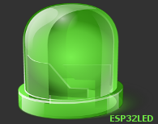

# ESP32LED
- How to Use ESP32 to Control LED With Delphi Via WiFi                    
 

## Built With

* [Cindy Component Library](https://sourceforge.net/projects/tcycomponents/files/tcycomponents/) - Cindy Component Library ( by Mauricio )
* [Arduino core for the ESP32 ](https://github.com/espressif/arduino-esp32) - Arduino core for the ESP32

# Features  

- Control LED With Delphi Via WiFi
- Save the state of the outputs of ESP32 in Inifile

# Sketch
* [Sketch](https://github.com/walwalwalides/Delphi-Collection-Arduino/tree/master/ESP32LED/Ardouino%20Sketch)- ESP32LED (Components + Sketch)

# Licence
Copyright (C) 2019-2020, walwalwalides (walwalwalides@gmail.com)          
                                                                         
This software is provided 'as-is', without any express or implied          
warranty. In no event will the authors be held liable for any damages      
arising from the use of this software.                                     
                                                                         
Permission is granted to anyone to use this software for any purpose,     
including commercial applications, and to alter it and redistribute it    
freely, subject to the following restrictions:                            

1. The origin of this software must not be misrepresented; you must not    
   claim that you wrote the original software. If you use this software    
   in a product, an acknowledgement in the product documentation would be  
   appreciated but is not required.                                        
2. Altered source versions must be plainly marked as such, and must not be 
   misrepresented as being the original software.                          
3. This notice may not be removed or altered from any source distribution.

## Files

| File | Contents | 
| --- | --- |
| .gitignore | Git ignores the files in this file |
| Circuit ESP32LED.png | circuit |
| ESP32LED.ino  |Ardouino Sketch|
| Main.pas | The main view of the programme |
| ESP32LED.dpk | The compiler project file |
| ESP32LED.dproj | The MSBUILD project file |
| README.md | The readme for this projec
