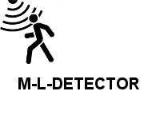

# M-L-DETECTOR
- Create Your Own Motion Light Detector

 

## Files

| File | Contents | 
| --- | --- |
| .gitignore | Git ignores the files in this file |
| M&L_DETECTOR_SK.PDF | Circuit |
| ML_Detector.ino  |Arduino Code|
| BUZZER_Detector.ino  |Arduino Code|
| EPPROM_Detector.ino  |Arduino Code|
| SERIAL_Detector.ino  |Arduino Code|
| README.md | The readme for this project
