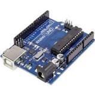

# Arduino-Collection
- My Own Arduino Collection   
**Authors:**  *WalWalWalides*

------

## Contains

| File | Contents | 
| --- | --- |
| .gitignore | Git ignores the files in this file |
| [ESP32LED](https://github.com/walwalwalides/Arduino-Collection/tree/master/ESP32LED) | How to Use ESP32 to Control LED With Delphi Via WiFi  |
| [RFID_ACCESS](https://github.com/walwalwalides/Arduino-Collection/tree/master/RFID_ACCESS)  |Read RFID via ardouino (serial communication) |
| [M&L DETECTOR](https://github.com/walwalwalides/Arduino-Collection/tree/master/M-L-DETECTOR) | Create Your Own Motion Light Detector |
| [Digi7Segment](https://github.com/walwalwalides/Arduino-Collection/tree/master/Digi7Segment)|Controle 7 Segment Display Via Ardouino - (Serial Communication) |
| [OLEDDisplay](https://github.com/walwalwalides/Arduino-Collection/tree/master/OLEDDisplay)|Controle OLED Display Via Ardouino - (Serial Communication) |
| README.md | The readme for this project
