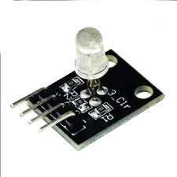

# RGB_LED_MIXER
- Create Your Own RGB LED Controller Using RGB LED Module.

 

## Built With

* [RGB MIXER Library](https://github.com/…/Delp…/tree/master/RGB%20Mixer%20Library) - RGB MIXER Library( by WalWalWalides )

## Files

| File | Contents | 
| --- | --- |
| .gitignore | Git ignores the files in this file |
| RGB_LED.PDF | Circuit |
| RGB_LED.ino  |Arduino Code|
| Main.pas | Main View of the programme |
| RGB_LED_MIXER.dpk | The compiler project file |
| RGB_LED_MIXER.dproj | The MSBUILD project file |
| README.md | The readme for this project |

