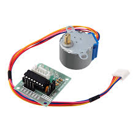

# SMC
- Create a Controller to Control a Stepper Motor Via Ardouino - (Serial Communication)                     
 

## Built With

* [OLED Library](https://github.com/walwalwalides/Delphi-Component/tree/master/OLED%20Library) - OLED Library( by WalWalWalides )
* [ComPort Library](https://sourceforge.net/projects/comport/files/comport/) - ComPort Library ( by Dejan Crnila )

# Features  

- Drive 28BYJ-48 stepper Motor using ULN2003A driver board .
- Change Rotaion Direction of Stepper Motor .

# Sketch
 - SMC

## Files

| File | Contents | 
| --- | --- |
| .gitignore | Git ignores the files in this file |
| SMC.ino  |Ardouino Sketch|
| Main.pas | The main view of the programme |
| About.pas | The About view of the programme |
| SMC.dpk | The compiler project file |
| SMC.dproj | The MSBUILD project file |
| README.md | The readme for this project |
